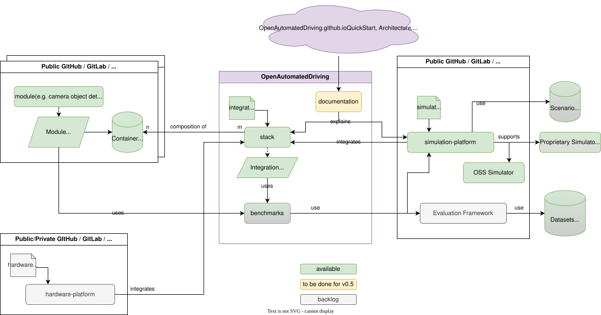

# Architecture Design

This section gives an overview on the architectural concepts and design decisions for the Open Automated Driving Stack.

## Ecosystem Architecture

A main enabler for efficient collaboration in open-source software development is the development ecosystem along with provided tools and governance. The main requirements for the meta architecture are:

- Isolated modules that can be used in different stacks
- Support for different AD stack architectures (e.g. modular vs. end-to-end)
- Transparent benchmarking and integration decisions.
- ...

The following diagram visualizes the resulting ecosystem architecture that defines the basis for collaboratively developing an Open Automated Driving Stack.

