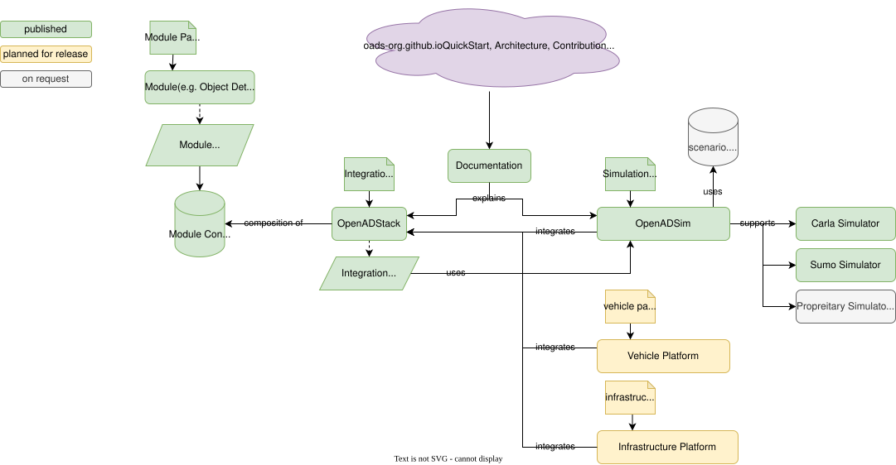

# 📐 Design

```{toctree}
:maxdepth: 2
:hidden:

```

## Architecture

The following diagram visualizes the OpenADS ecosystem architecture that defines the foundation for collaboratively developing Open Automated Driving Systems.

### OpenADSystems: The Open Automated Driving Ecosystem

A comprehensive documentation serves as the main entry point to the OpenADS ecosystem. It enables a low-effort jump start to get everything up and running and to begin using and contributing to OpenADS. It explains the architecture of the functional components and tooling that enable the use of the OpenADStack with OpenADSimulation.



More details on [OpenADStack](../openadstack/openadstack.md), the open automated driving stack, [OpenADSim](../openadsim/openadsim.md), the open automated driving simulation framework, and [OpenADSuite](../openadsuite/openadsuite.md), the open automated driving development suite, can be found in the dedicated sections of this documentation.

## Design Goals

OpenADS is the result of intense discussions held as part of research and industry projects, PhD theses, student theses, hackathons, and demonstration events in the context of automated and connected mobility. As one of the largest German research institutes in Automotive Engineering with a history of more than 120 years, the Institute for Automotive Engineering at RWTH Aachen University has been actively researching automated and connected driving and founded a dedicated research department for *Vehicle Intelligence and Automated Driving* in 2019. As the team grew and more students were eager to participate in research and development, early architectural designs reached their limits and needed improvement.

[The Robot Operating System (ROS)](https://ros.org/) has become the leading software ecosystem for automated driving research and is used in other open-source projects like [Autoware](https://autoware.org/). Backed by an active open-source community, ROS offers a wealth of helpful base libraries and tooling, to mention just a few:

- 📦 Huge ecosystem of ROS libraries and tools, e.g. [common interface definitions](https://github.com/ros2/common_interfaces) and the [Transform Library](https://docs.ros.org/en/rolling/Concepts/Intermediate/About-Tf2.html) for spatio-temporal transformations, available as released packages listed in [ROS Index](https://index.ros.org) or from open-source projects.
- 🔧 [Dependency management](https://docs.ros.org/en/rolling/Tutorials/Intermediate/Rosdep.html) and [build toolchain](https://docs.ros.org/en/humble/Concepts/Advanced/About-Build-System.html).
- 📡 Support for different communication middleware implementations (e.g. [Eprosima FastDDS](https://github.com/ros2/rmw_fastrtps) or [Zenoh](https://github.com/ros2/rmw_zenoh)), abstracted by a ROS middleware adapter with support for different [Quality of Service](https://docs.ros.org/en/rolling/Concepts/Intermediate/About-Quality-of-Service-Settings.html) settings and [zero-copy inter-process communication](https://github.com/ros2/rmw_zenoh#zenoh-shared-memory).
- 📚 And much more as explained in the [ROS Developer Documentation](https://docs.ros.org).

With the transition from ROS, which originally targeted only rapid prototyping and research, to ROS 2 — also targeting industrial deployment with a focus on real-time capability and safety — the team behind OpenADS completely redesigned the architecture. The previous design had become difficult to maintain and extend with an increasing number of developers involved. The redesign focuses on the following goals:

- 💻 **Code first:** Instead of spending too much time discussing standards and theoretically perfect architectures, we collected what we had developed and learned from the past, combined it with available open-source tools and practices, and drafted a working minimum viable product.
- ♻️ **Reusability for distributed teams:** Teams are often involved in different projects with different focuses. However, there is significant potential for reusing and extending existing solutions without excessive overhead caused by system complexity.
- 📈 **Scalability in mind:** It should be as easy as possible to leverage existing open-source software instead of reinventing the wheel over and over again.

## OpenADS Design

- 🧬 **Microservice architecture**: Isolated modules that can be used in different stacks, enabling easy module development in distributed teams without requiring system-wide knowledge. OpenADS isolates modules at the ROS package level. Typically, each repository contains one ROS package. It may contain multiple packages if they are closely related (e.g., interface definitions alongside functional packages). This allows isolated development and discussions (e.g., in issues), while CI/CD workflows ensure integration into the overall system.
- 📦 **Containerization**: Each module defines its dependencies and provides all information needed to build a self-contained container image in its repository. Combined with the provided development environment, developers can start coding on individual modules right away without needing to understand or run the entire system.
- 🔀 **Flexibility**: Automated Driving System architectures are evolving rapidly — from late-fusion to early-fusion perception approaches and from modular to end-to-end planning approaches. The modular and CI/CD-based design of OpenADS enables flexibility without requiring restructuring of the overall system or other modules.
- 🔍 **Transparency**: Open-source CI tests and benchmarks, defined by the community to evaluate both functional performance and code quality, enable transparent evaluation of contributed modules and facilitate decisions on which modules to integrate or remove to keep the system clean and maintainable.
