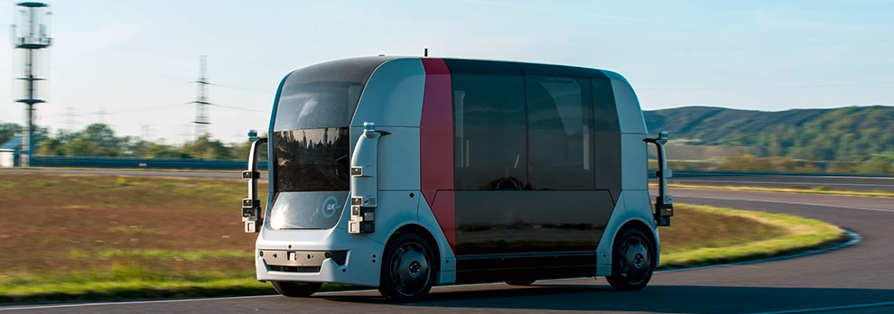
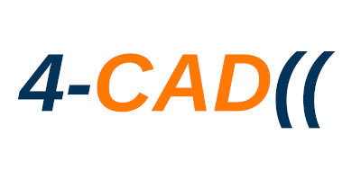
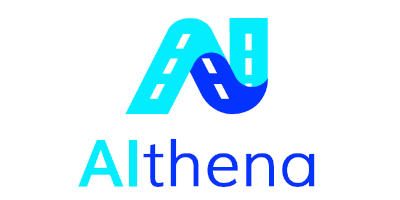
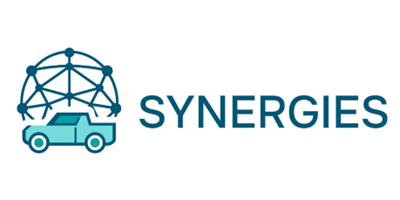
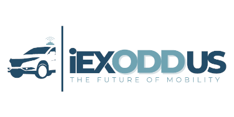

# OpenADS

```{toctree}
:maxdepth: 2
:hidden:

start/start
design/design
openadstack/openadstack
openadsim/openadsim
openadsuite/openadsuite
openadsafety/openadsafety
support/support.md
```

<div align="center">
  <video controls autoplay width="720" src="https://github.com/user-attachments/assets/7dff88b3-5496-4715-b393-c3c4d9ecc4a3"></video>
  <br>
  <em>Watch OpenADStack in action above or <a href="https://www.youtube.com/watch?v=B0Lnu-1w9KE">open the full video on YouTube</a>.</em>
</div>
<br>

The Open Automated Driving Systems project is a **collaborative, open-source ecosystem for Automated Driving Systems** comprising the following features:

- 🤖 [**OpenADStack**](./openadstack/openadstack.md) is a fully-functional open-source reference implementation of an Automated Driving System based on [ROS 2](https://www.ros.org/). It comprises perception, understanding, planning, and actuation modules, which are called [OpenADServices](https://github.com/search?q=topic%3Aopenadservice&type=repositories).
- 🎮 [**OpenADSim**](./openadsim/openadsim.md) supports multiple simulators for prototyping and testing, including [CARLA](https://carla.org/) for environment and vehicle simulation and [SUMO](https://eclipse.dev/sumo/) for urban traffic simulation.
- 🛠️ [**OpenADSuite**](./openadsuite/openadsuite.md) provides development tools that streamline developer workflows, such as module templates and ready-to-use development environments.
- 🛡️ [**OpenADSafety**](./openadsafety/openadsafety.md) comprises benchmarks and tools for verification and validation of automated driving modules and full automated driving stacks, including scenario-based testing with [OpenADSim](./openadsim/openadsim.md).

{align=center}

## Integrations

OpenADS is used in multiple real implementations, including research vehicles of different sizes, as well as, infrastructure test fields. If you are also an active user of OpenADS, you are welcome to [add your own integrations](https://github.com/openads-project/openads-project.github.io/edit/init/docs/index.md) relying on OpenADS.

### Research Vehicles

#### karl. | Research Vehicle for Automated and Connected Driving

[{align=center}](https://www.youtube.com/watch?v=iiaNbFkfEA0){target="_blank"}
_Click on the image for a video demonstration_

[karl.](https://www.ika.rwth-aachen.de/en/competences/equipment/research-vehicles/karl-en.html) is a customizable and extensible research platform designed for developing and validating innovative functions for automated and connected driving by the [Institute for Automotive Engineering (ika)](https://www.ika.rwth-aachen.de/en/) of RWTH Aachen University.

The vehicle is run by perception, understanding, planning and control modules from OpenADStack and also virtually integrated into OpenADSim.

#### autoSHUTTLE | Demonstrating the future of urban transportation

[{align=center}](https://www.youtube.com/watch?v=DCx0iTOmsMI){target="_blank"}
_Click on the image for a video demonstration_

The [autoSHUTTLE](https://www.ika.rwth-aachen.de/en/competences/equipment/research-vehicles/unicaragil-autoshuttle-en.html) was built up in the [UNICARagil project](https://www.unicaragil.de/en/) by a consortium of 16 universities and companies at ten locations in Germany. It was built completely from scratch demonstrating disruptive new architectures for geometry, electrics/electronics, software, and function especially targetting driverless vehicles. In the [autotech.agil](https://www.autotechagil.de/en/) follow-up project, it was embedded into a cooperative and automated mobility system together with 9 other vehicles from different project partners.

The vehicle is now operated by the [Institute for Automotive Engineering (ika)](https://www.ika.rwth-aachen.de/en/) of RWTH Aachen University and uses perception, understanding, planning and control modules from OpenADStack. It is also virtually integrated into OpenADSim.

### Infrastructure

#### RITA | Road Infrastructure Testfield Aachen

{align=center}

[RITA](https://www.ika.rwth-aachen.de/en/competences/equipment/infrastructure/roadside-infrastructure.html) is an infrastructure testfield at Campus Melaten in Aachen, Germany, operated by the [Institute for Automotive Engineering (ika)](https://www.ika.rwth-aachen.de/en/) of RWTH Aachen University. It supplys highly accurate real-time reference data from road users for connected and automated vehicles and uses perception modules from OpenADStack. It is also virtually represented in OpenADSim.

## Projects

OpenADS has been developed and used in several national and international projects. You are welcome to [add your own projects](https://github.com/openads-project/openads-project.github.io/edit/init/docs/index.md) relying on OpenADS.

::::{grid} 1 1 2 3
:gutter: 2

:::{grid-item-card}
:class-card: sd-text-center
[](https://www.unicaragil.de/en/)
:::

:::{grid-item-card}
:class-card: sd-text-center
[](https://www.autotechagil.de/en/index.htm)
:::

:::{grid-item-card}
:class-card: sd-text-center
[](https://6gem.de/en/)
:::

:::{grid-item-card}
:class-card: sd-text-center
[](https://6gem.de/en/)
:::

:::{grid-item-card}
:class-card: sd-text-center
[](https://www.ika.rwth-aachen.de/en/competences/projects/automated-driving/4-cad-en.html)
:::

:::{grid-item-card}
:class-card: sd-text-center
[](https://aithena.eu/)
:::

:::{grid-item-card}
:class-card: sd-text-center
[](https://aiggregate.eu/)
:::

:::{grid-item-card}
:class-card: sd-text-center
[](https://synergies-ccam.eu/)
:::

:::{grid-item-card}
:class-card: sd-text-center
[](https://iexoddus-project.eu/)
:::

::::
