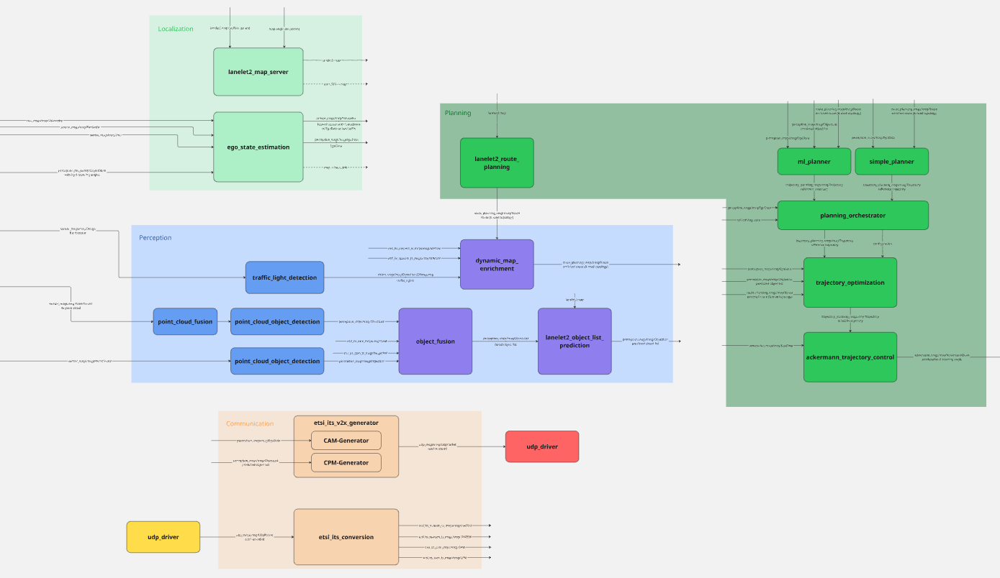

# 🧠 OpenADStack

```{toctree}
:maxdepth: 2
:hidden:

services
```

## Overview



- link to OpenADStack repo
- replace image with link to ad-stack architecture in openadstack repo
- blueprint library, different compositions
- explain docker compose and configuraiton via env variables and parameter file mounts

## OpenADServices

OpenADStack consists of several modules/services, e.g. for perception, understanding, motion planning and control tasks. Have a look at the [list of services](services.md) for an overview and references to the detailed documentation of the services.
