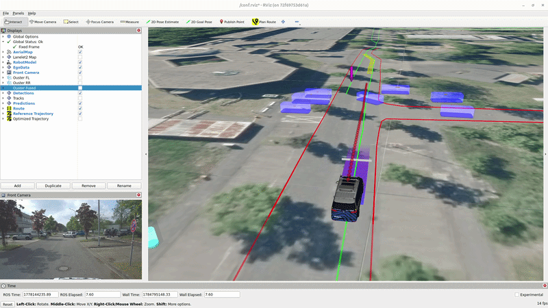
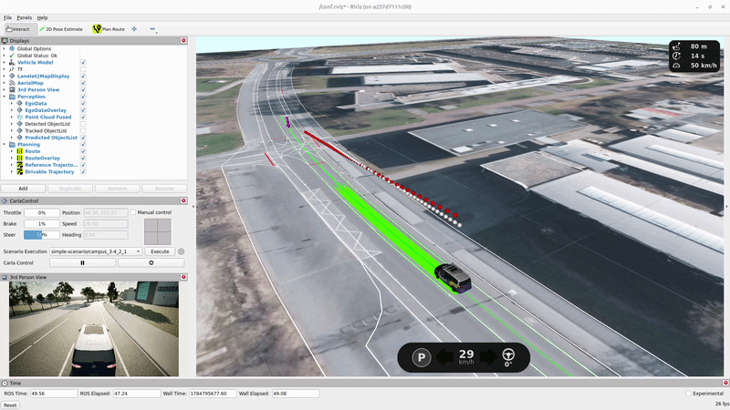

# 🚀 Quick Start

```{toctree}
:maxdepth: 2
:hidden:
```

## Requirements

- The disk space required for pulling all necessary Docker images is:
  - **$DISK_SIZE_OPENADSTACK** for the *OpenADStack* images without perception modules,
  - **$DISK_SIZE_PERCEPTION** for the *OpenADStack* images **with perception modules**,
    - **$DISK_SIZE_DEMODATA** for the *OpenADStack* demo data (for open-loop testing only),
  - **$DISK_SIZE_OPENADSIM** for the whole toolchain including *OpenADSim* with *OpenADStack*.
- While some modules are built for `arm64` architectures (e.g. used in *NVIDIA Jetson Orin*), the complete toolchain is only supported on `amd64`.
- Thanks to consequent containerization, most Linux operating systems supporting [Docker](https://www.docker.com/) should be fine. However, we currently test only on `Ubuntu 24.04`.
- Current installations of [Docker (≥ 29.5.2)](https://docs.docker.com/engine/install/ubuntu/) and [Docker Compose (≥ 5.1.4)](https://docs.docker.com/compose/install/) are required. Some parts of OpenADS (e.g. using CARLA in [OpenADSim](../openadsim/openadsim.md) and some machine learning-based services) require a current [NVIDIA driver (≥ 590)](https://docs.nvidia.com/datacenter/tesla/driver-installation-guide/latest/ubuntu.html) and the [NVIDIA Container Toolkit (≥ 1.19.1)](https://docs.nvidia.com/datacenter/cloud-native/container-toolkit/latest/install-guide.html).
- NVIDIA GPU with at least 8 GB VRAM is recommended.
- Make sure your user is added to the `docker` group to be able to use Docker without root privileges. This can be done with `sudo usermod -aG docker $USER`, which  will be effective after a new login.
- As some services (e.g. monitoring and simulation) may need graphical output, make sure to allow local connections to the X server to enable graphical output from Docker containers, e.g. by executing `xhost +local:` in a terminal.
- The development environment is based on [Visual Studio Code](https://code.visualstudio.com/) with [Remote Development Extension Pack](https://marketplace.visualstudio.com/items?itemName=ms-vscode-remote.vscode-remote-extensionpack).

> [!IMPORTANT]
> Please [open an issue](https://github.com/openads-project/openads-project.github.io/issues/new/choose) and describe your setup and problems, if this quick start guide does not work for you.

## Running OpenADStack on recorded data

Clone the [OpenADStack](https://github.com/openads-project/openadstack) repository and start the provided docker composition. This will pull the required Docker images and run the stack on recorded sensor data.

{align=center width=500}

- **Basic Demo without Perception:** Start the open-loop demo using recorded detections:

```bash
git clone --recursive https://github.com/openads-project/openadstack.git
    cd openadstack/demo
docker compose up -d
```

  - **Full Demo:** Start the open-loop demo including perception OpenADServices running on recorded raw sensor data:

    ```bash
    export COMPOSE_FILE=docker-compose.demo-full.yml && docker compose up -d
    ```

- **Stop** the demo with:

  ```bash
  docker compose down
  ```

Chekout the [OpenADStack](../openadstack/openadstack.md) section for more information.

## Running OpenADSim for closed-loop simulation

Clone the [OpenADSim](https://github.com/openads-project/openadsim) repository and start the provided docker composition. This will pull the required Docker images and run the stack in CARLA simulation.

{align=center width=500}

```bash
git clone --recursive https://github.com/openads-project/openadsim.git
cd openadsim
docker compose up -d
```

The execution can be stopped with `docker compose down`. Checkout the [OpenADSim](../openadsim/openadsim.md) section for more information.
